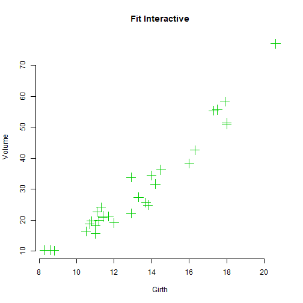

Girth and Volume for Black Cherry Trees - Fit Interactive
========================================================
author: Carlos A. Gimenez
date: 2017-08-20
autosize: true


Content
========================================================

- Introduction
- Data Set Trees (summary)
- App features
- Example Plot

Introduction
========================================================

This study provides and interactive regression of  volume vs girth,  of timber in 31 felled black cherry trees. Note that girth is the diameter of the tree (in inches) measured at 4 ft 6 in above the ground. 

You can found all the documentation here: https://github.com/carlosgim/ddp


Data Set Trees (summary)
========================================================

The summary of the data set used in this study is:


```r
summary(trees)
```

```
     Girth           Height       Volume     
 Min.   : 8.30   Min.   :63   Min.   :10.20  
 1st Qu.:11.05   1st Qu.:72   1st Qu.:19.40  
 Median :12.90   Median :76   Median :24.20  
 Mean   :13.25   Mean   :76   Mean   :30.17  
 3rd Qu.:15.25   3rd Qu.:80   3rd Qu.:37.30  
 Max.   :20.60   Max.   :87   Max.   :77.00  
```

Our interest is calculate the volume of the trees telated
to the girth size.

App features
========================================================

The main features of the app are:

- Selection of the area of fit with the mouse.
- Show the slope and intersection
- Choose the kind of shape points
- Choose the size of points
- Choose color of points
- Show/Hide X Axis Label
- Show/Hide Y Axis Label
- Show/Hide Title

Example Plot
========================================================


```r
plot(trees$Girth, trees$Volume,
         cex =  2, pch = 3, bty = "n", main = "Fit Interactive",
         xlab = "Girth", ylab = "Volume", col=3)
```



End
========================================================

Thanks!
